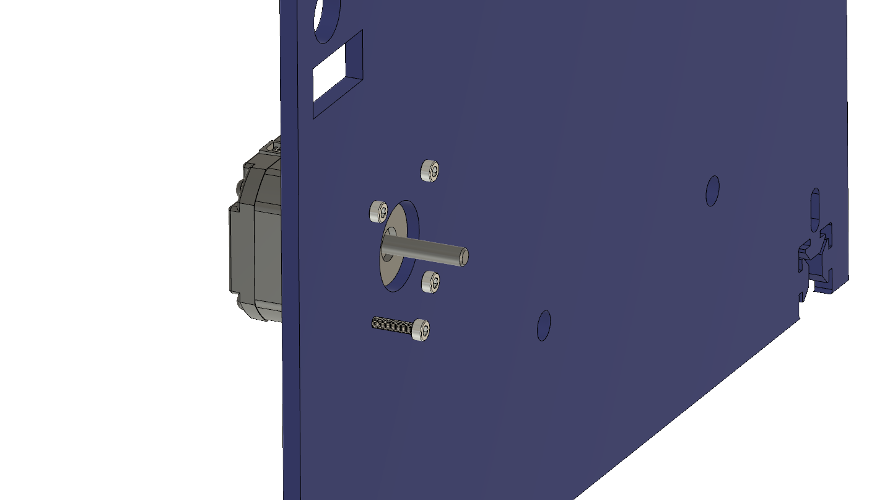
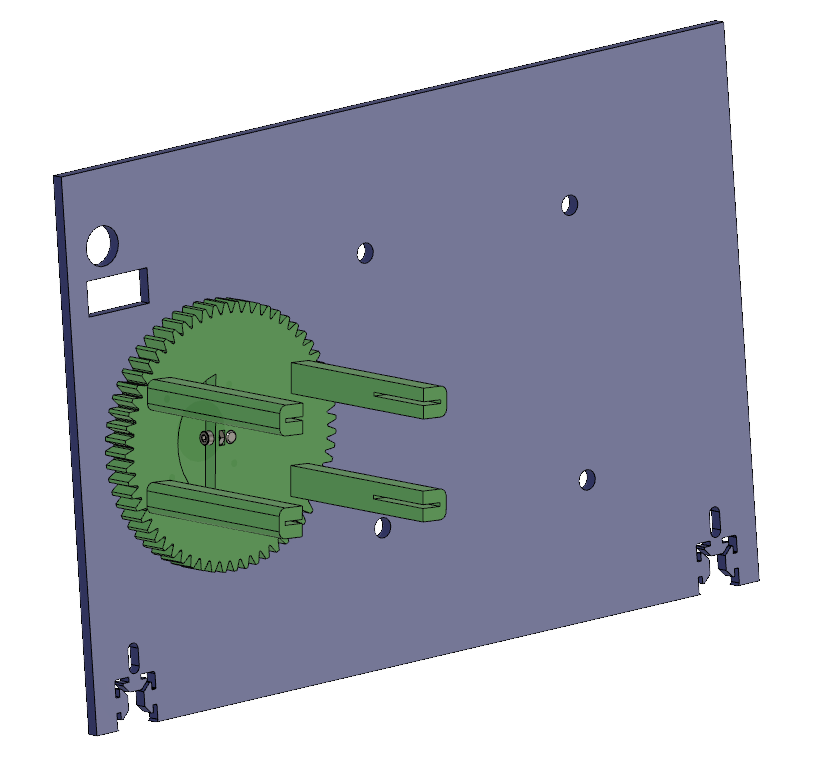
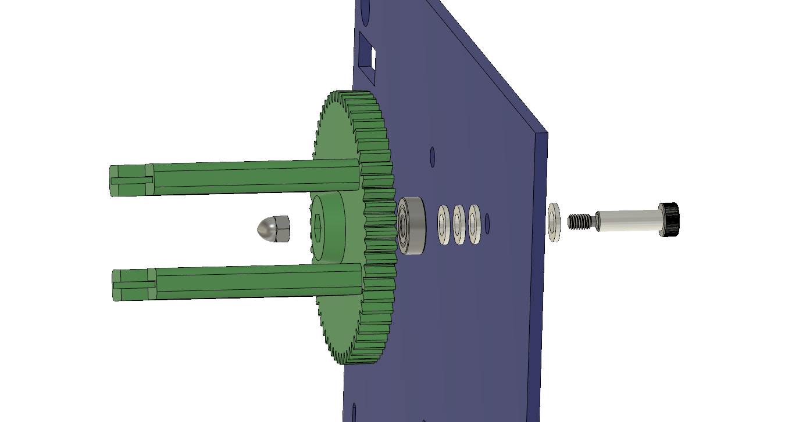
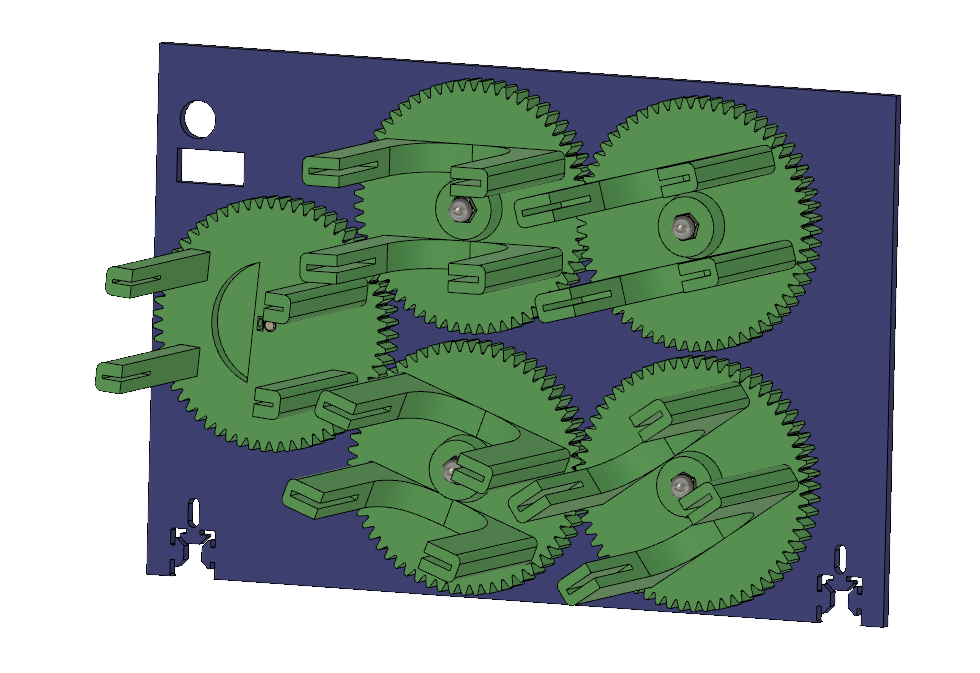
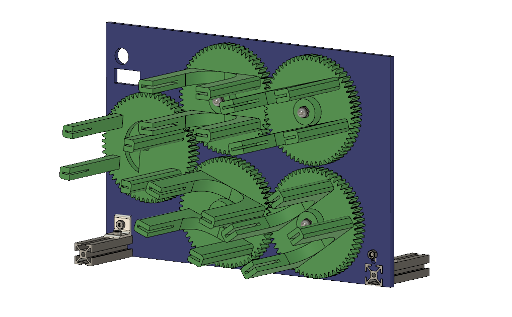
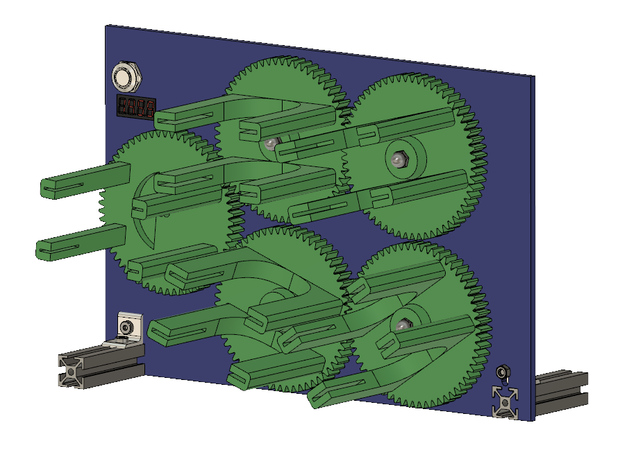
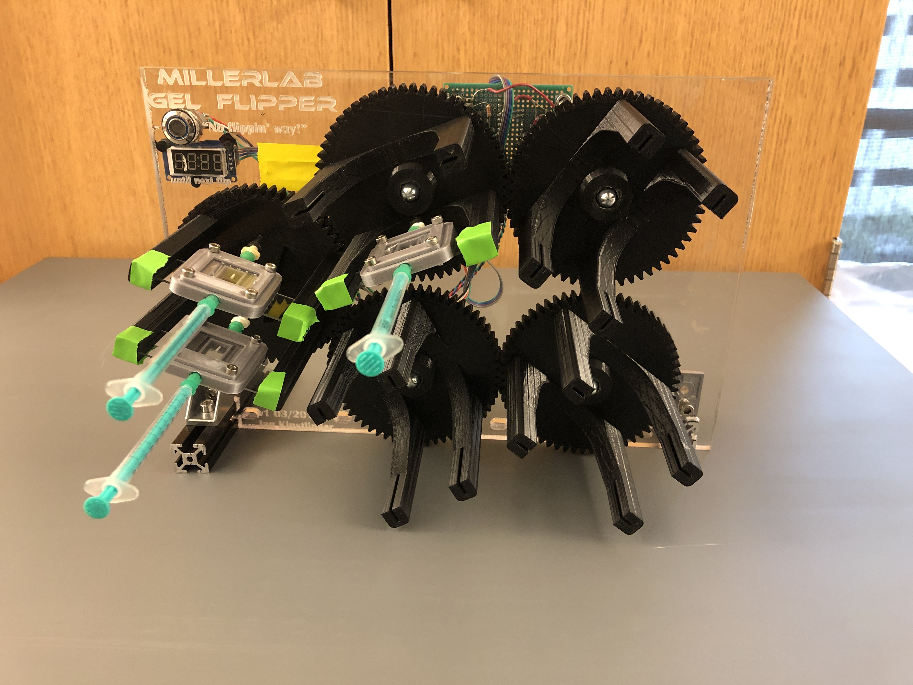
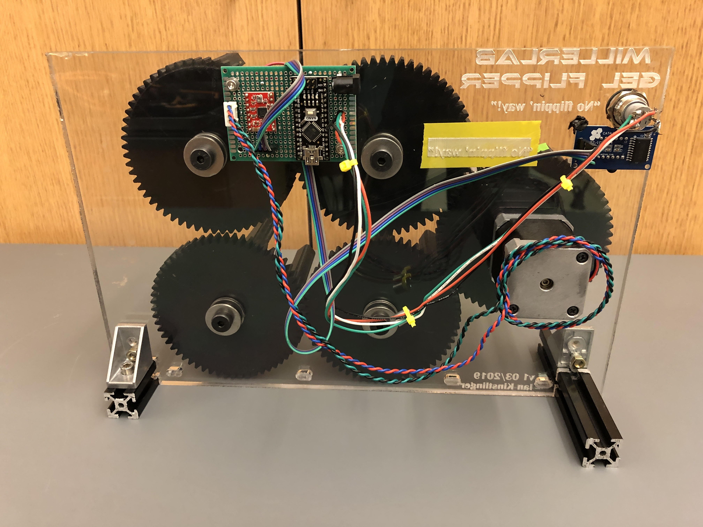

### Assembly instructions for gel flipper hardware 
### See BOM for parts list needed for this build

### 1. Fabricate laser-cut acrylic sheet and 3D print gears

Laser cutting: Adjust DXF file as needed for a larger or smaller flipper design. Gears should be 102 mm apart, center-to-center. Fun customizations are highly encouraged!
3D printing: Print one motor gear (mounts to a NEMA 17 shaft) and 4x (or as many as needed for your altered design) free gears which spin on bearings. Custom gear designs can help you fit more gels on at a time, use a gear radius (including teeth) of 60 mm.

### 2. Attach NEMA 17 motor

Use standard M3 hex bolts

### 3. Mount motor gear

Depending on the tolerance of your printer, the gear may sit tightly on the shaft, or may need to be secured. Use an M3x6 set screw and M3 nut to lock it in place

### 4. Mount free gear

First, mount the 608z bearing into the recess in the back face of the gear, making sure the surfaces are flush. Depending how tight the fit is, you may need to tap gently with a mallet. Then slide the shoulder screw through as many washers as needed, through the bearing, and secure with the cap nut. Don't overtighten, and make sure that the bearing spins smoothly. 

### 5. Mount remaining free gears

Repeat step 4 for remaining free gears. Carefully line up the teeth of the gears and make sure they all spin smoothly when spun by hand. If they don't spin smoothly, check individual gears and make sure the bearings are aligned with the gears. 

### 6. Add feet for stability

You can design feet in other ways, but this is quick and easy if you have some spare aluminum extrusion. Use M5 screws and corner brackets to secure, or adjust the acrylic lasercutting pattern for your needs.

### 7. Mount electronics

The push buttons from Adafruit have a nice collar design for mounting on a panel. The 4 digit display may be screwed in, but we used some hot glue. For the main controller, we drilled some extra holes in the acrylic and mounted with aluminum spacers, see below.

## Finished product:

### Front view: 

### Back view:
