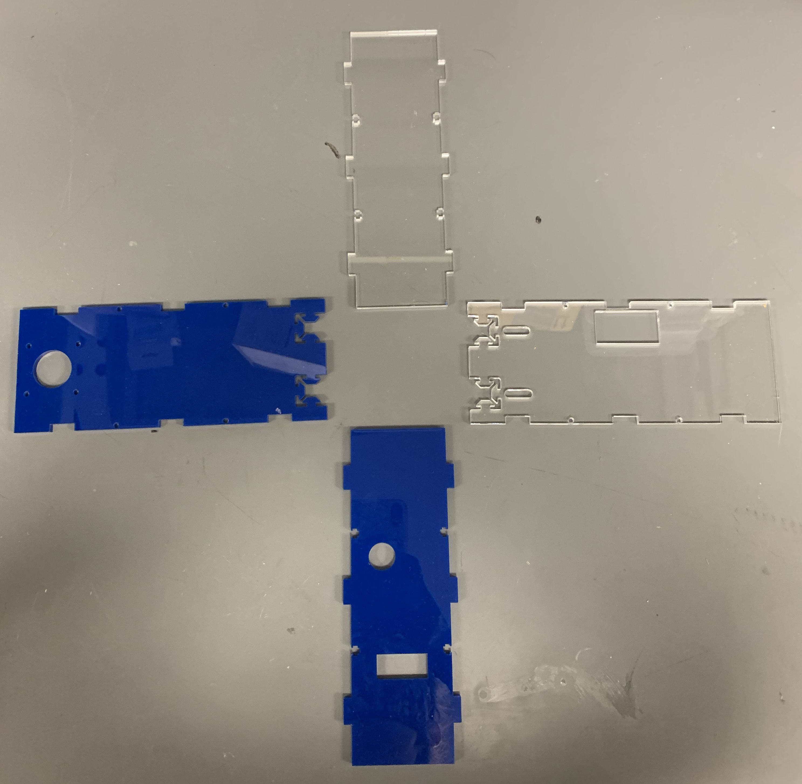
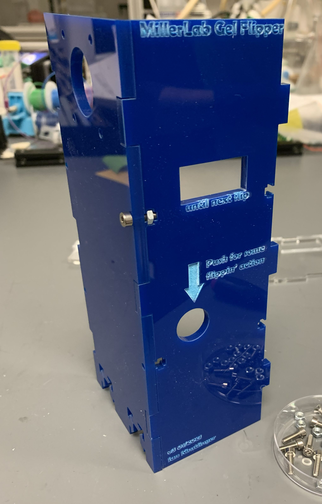
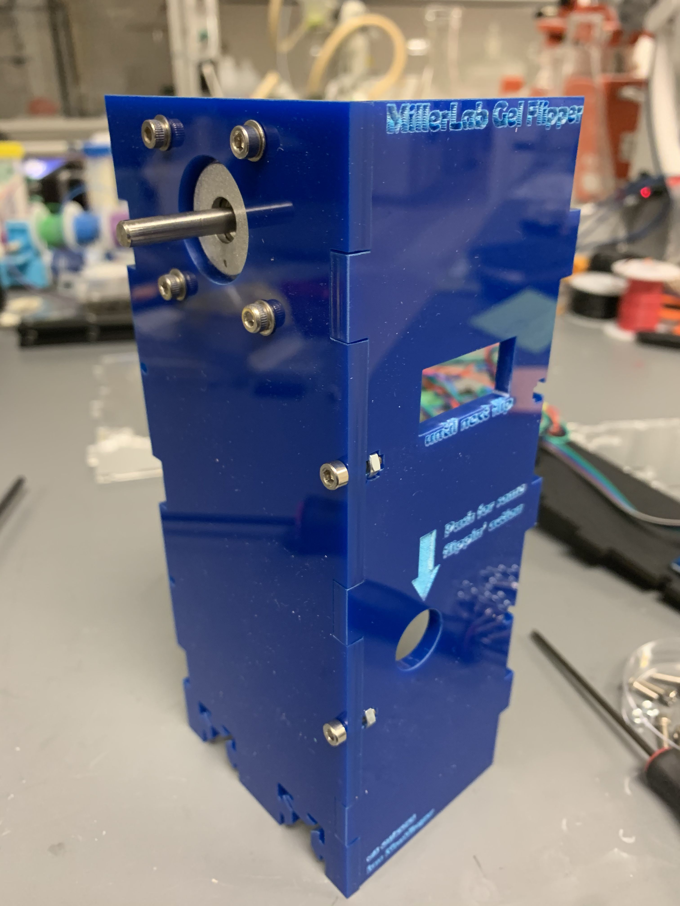
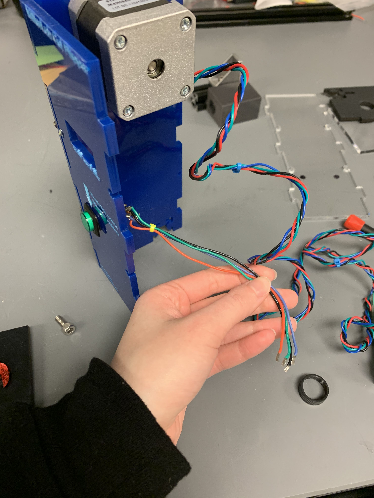
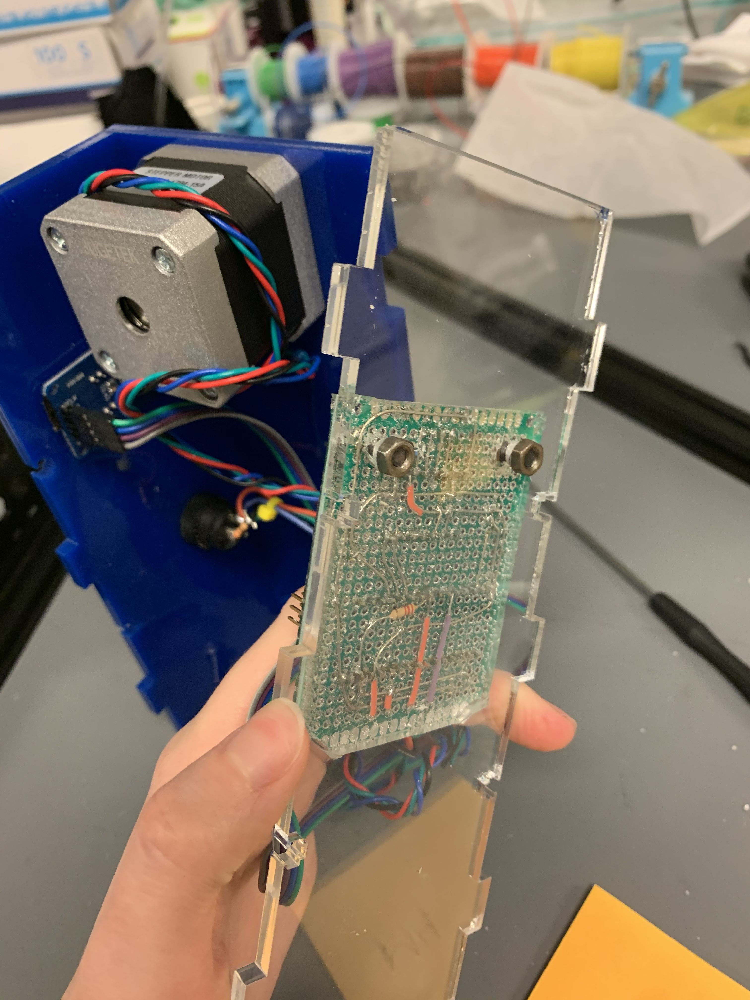
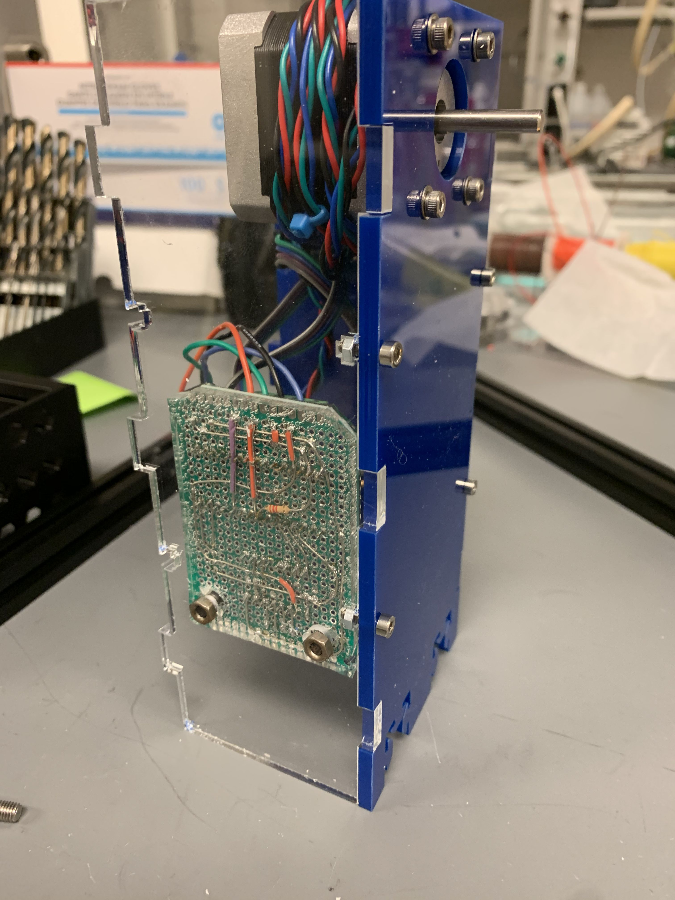
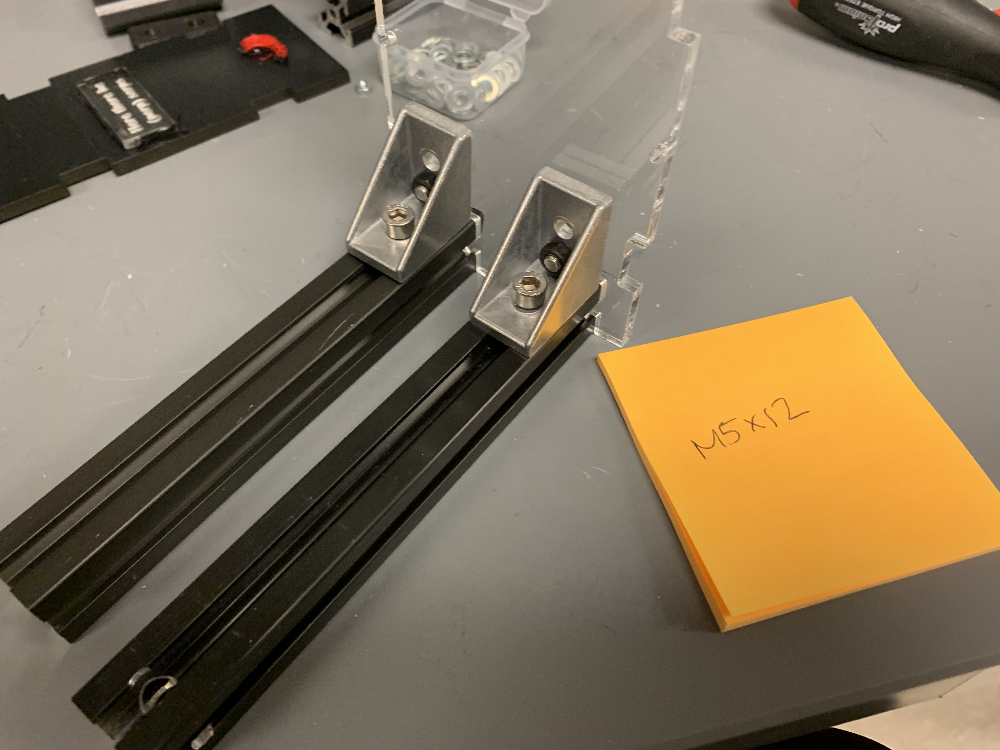
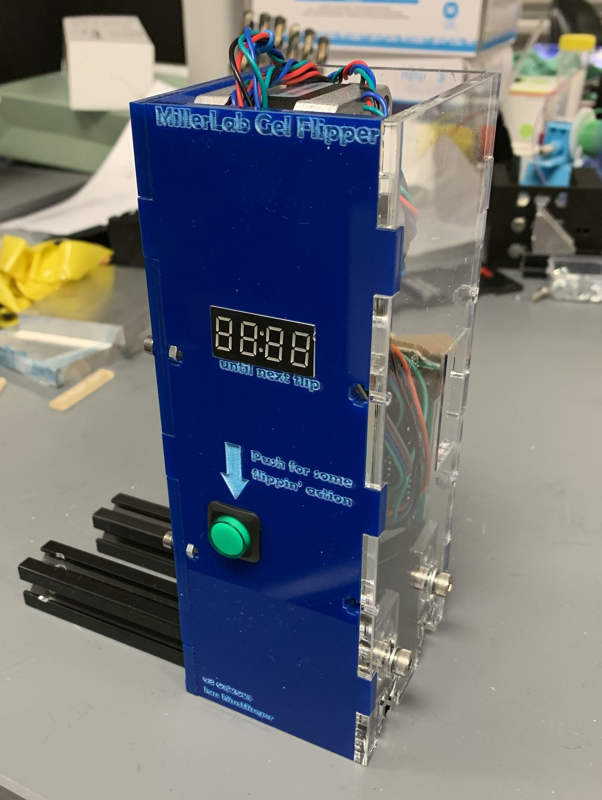
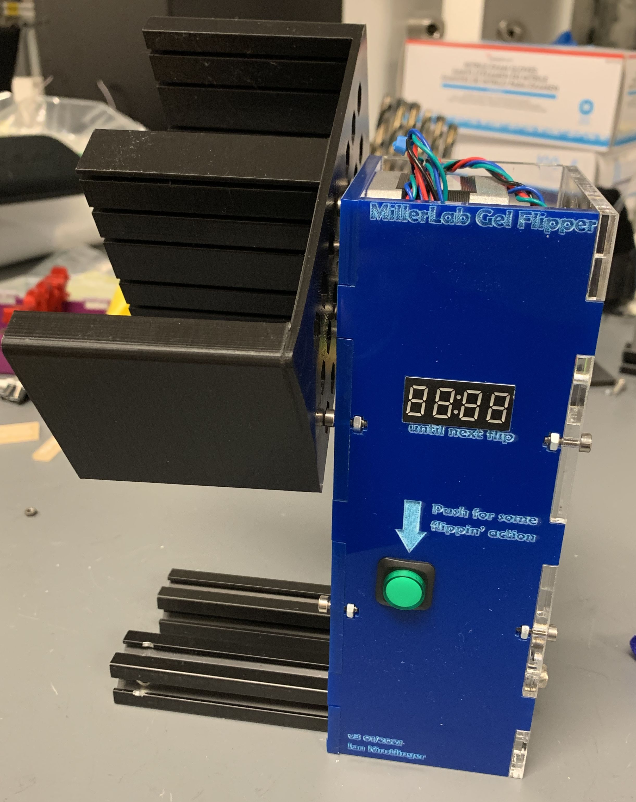

### Assembly instructions for gel flipper hardware -- tower version

### See BOM for parts list needed for this build

### 1. Fabricate laser-cut acrylic sheet and 3D print gears

Laser cutting: Adjust DXF file as needed. Interlocking tabs should change size if you use acrylic of thickness other than 3/16". Text is added in the Illustrator and PDF files. Fun color and customizations are encouraged!
3D printing: Print the chamber-holding piece which slides onto the motor shaft (not shown here). 

### 2. Assemble first two walls

Use M3-10mm bolts and M3 nuts to secure the motor-side wall to the button-side wall. Nuts slide into the traps from the side. Carefully tighten until the pieces don't wiggle, but don't overtighten or the acrylic can crack.

### 3. Attach NEMA 17 motor

Use M3 hex bolts and washers.

### 4. Mount button and time display

Install the 7 segment display and start/stop button into the laser-cut slots. If the display is not snug against the acrylic, it can be hot glued or taped from the back.

### 5. Mount controller onto acrylic wall

Use nuts and bolts to attach the Arduino controller to the acrylic piece shown. Here, we drilled 4mm holes in the acrylic and the protoboard. You can also add these holes to the original laser cutting file. It doesn't matter what diameter bolts are used, but we used M4 here. Note that we also encased the controller circuit in PDMS (Sylgard 184) to protect it from degradation in the incubator.

### 6. Join controller wall with other walls

Use more M3-10mm bolts and nuts to add the third wall to the first two. At this stage, we suggest using acrylic glue to semi-permanently hold together these 3 walls. Use caution when handling the glue; wear gloves and safety glasses and work in a well-ventilated workspace.

At this point, if not already connected, plug the start button and timer display into the controller. 

### 7. Mount aluminum T-slot legs onto final wall

We use T-Slot extrusion as a stable base for the flipper so that when gels are flipped, their added weight doesn't topple the tower. It can be cut to size with a hacksaw, and the exact length is not critical as long as the tower is stable.

Here we use M5 nuts and brackets to secure the T-slot; other mounting hardware is possible too.

### 8. Assemble final  wall

Feed the free end of the aluminum extrusion through the slots in the motor-side wall until the final wall slots into place. Use M3-10mm bolts to secure.

### 9. Add chamber holder

Press-fit the 3D printed gel perfusion chamber holder onto the shaft of the motor. If it does not slide on, or is too tight, you may need to adjust the size of the shaft hole in Fusion, then re-print. 

At this point, the flipper is fully assembled. Flash firmware onto the Arduino and give it a spin!

